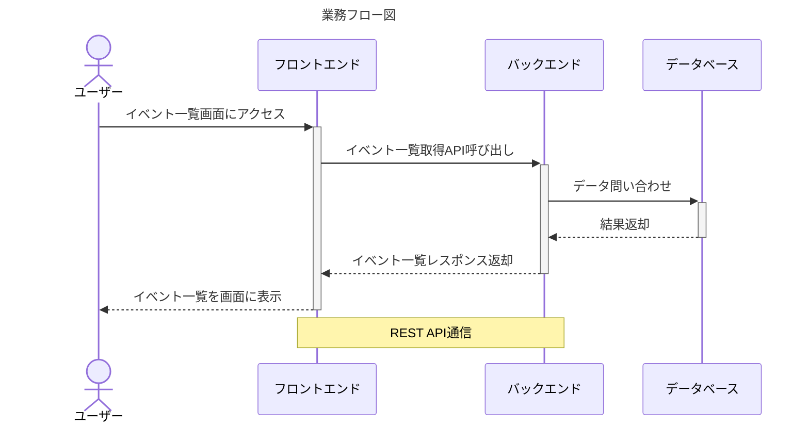

```mermaid
sequenceDiagram
  title: 業務フロー図
  actor ユーザー
  participant フロントエンド
  participant バックエンド
  participant データベース

  ユーザー->>+フロントエンド: イベント一覧画面にアクセス
  フロントエンド->>+バックエンド: イベント一覧取得API呼び出し
  バックエンド->>+データベース: データ問い合わせ
  データベース-->>-バックエンド: 結果返却
  バックエンド-->>-フロントエンド: イベント一覧レスポンス返却
  フロントエンド-->>-ユーザー: イベント一覧を画面に表示
  Note over フロントエンド,バックエンド: REST API通信
```
