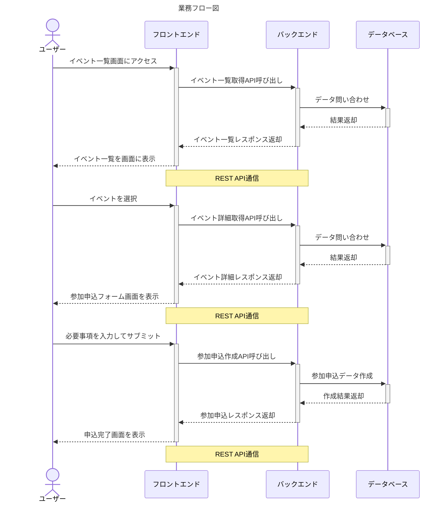

```mermaid
sequenceDiagram
  title: 業務フロー図
  actor ユーザー
  participant フロントエンド
  participant バックエンド
  participant データベース

  ユーザー->>+フロントエンド: イベント一覧画面にアクセス
  フロントエンド->>+バックエンド: イベント一覧取得API呼び出し
  バックエンド->>+データベース: データ問い合わせ
  データベース-->>-バックエンド: 結果返却
  バックエンド-->>-フロントエンド: イベント一覧レスポンス返却
  フロントエンド-->>-ユーザー: イベント一覧を画面に表示
  Note over フロントエンド,バックエンド: REST API通信

  ユーザー->>+フロントエンド: イベントを選択
  フロントエンド->>+バックエンド: イベント詳細取得API呼び出し
  バックエンド->>+データベース: データ問い合わせ
  データベース-->>-バックエンド: 結果返却
  バックエンド-->>-フロントエンド: イベント詳細レスポンス返却
  フロントエンド-->>-ユーザー: 参加申込フォーム画面を表示
  Note over フロントエンド,バックエンド: REST API通信

  ユーザー->>+フロントエンド: 必要事項を入力してサブミット
  フロントエンド->>+バックエンド: 参加申込作成API呼び出し
  バックエンド->>+データベース: 参加申込データ作成
  データベース-->>-バックエンド: 作成結果返却
  バックエンド-->>-フロントエンド: 参加申込レスポンス返却
  フロントエンド-->>-ユーザー: 申込完了画面を表示
  Note over フロントエンド,バックエンド: REST API通信
```
